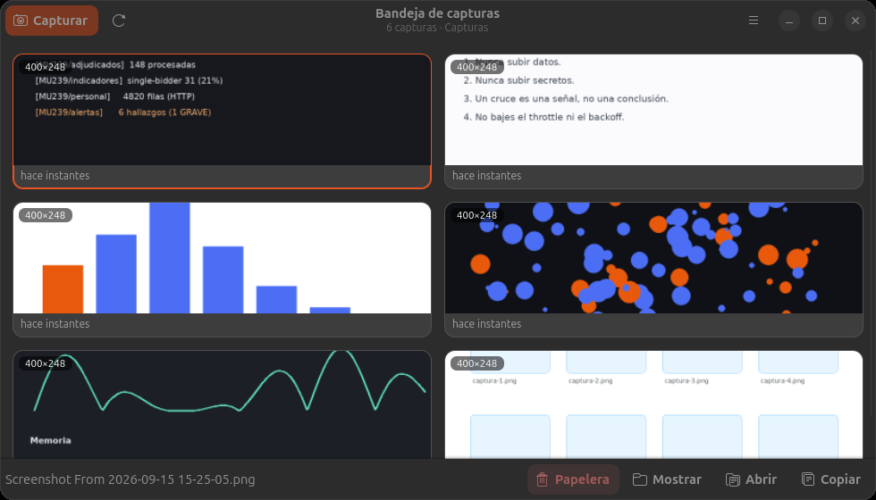
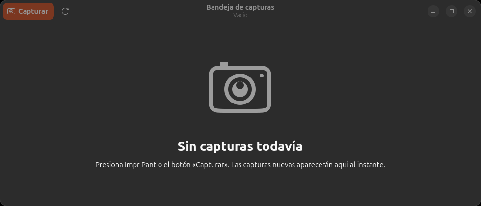
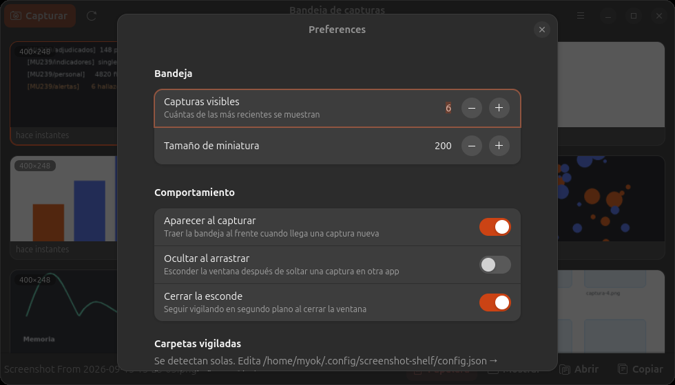

<div align="center">

# 📸 Bandeja de capturas

**Tus últimas capturas, siempre a mano y listas para arrastrar.**

GNOME guarda todo en `~/Pictures/Screenshots`, pero para adjuntar una captura hay que
abrir el explorador y buscarla. Esto elimina ese paso.



<sub>🇬🇧 <a href="README.md">Read me in English</a></sub>

</div>

---

## Por qué lo hice

Trabajo con [Claude Code](https://claude.com/claude-code) en [Ghostty](https://ghostty.org)
y me topaba siempre con la misma fricción: capturaba un pedazo de frontend para
mostrárselo — un layout roto, un componente que quedó torcido — y se me iba más tiempo
en adjuntar la imagen que en explicar el problema. Abrir Archivos, buscar la carpeta,
ordenar por fecha, arrastrar.

Así que hice una bandeja que deja las últimas capturas a un arrastre de distancia.
Tomas el pantallazo, arrastras la miniatura directo al terminal y sigues escribiendo.
Funciona con cualquier cosa que acepte un archivo soltado, pero ese es el flujo para el
que nació.

## Cómo funciona

```
Impr Pant  →  la bandeja salta al frente  →  arrastras la miniatura  →  la sueltas donde sea
```

1. **Capturas como siempre**: `Impr Pant`, o el botón *Capturar*.
2. **La bandeja aparece sola**, con la captura nueva ya seleccionada.
3. **Arrastras la miniatura** a un terminal, el navegador, Slack, Telegram, GIMP, un correo…

La selección es de a una: siempre arrastras exactamente la captura que acabas de tomar.

<div align="center">

</div>

## Instalación

```bash
./install.sh              # lanzador + atajo Super+Shift+S
./install.sh --autostart  # además arranca con la sesión y vigila en segundo plano
./install.sh --uninstall  # revierte todo
```

> **Requisitos** · Ubuntu con GNOME (probado en 25.10 / GNOME 49, Wayland) y
> `python3-gi gir1.2-gtk-4.0 gir1.2-adw-1`, que vienen preinstalados.
>
> Corre con el Python del sistema (`/usr/bin/python3`). Si usas pyenv da igual: el
> lanzador ya apunta al intérprete correcto.

## Atajos

| Atajo | Acción |
|:--|:--|
| `Super+Shift+S` | Mostrar/ocultar la bandeja (global) |
| **Arrastrar** | Soltar la captura en otra app |
| `Ctrl+N` | Capturar pantalla |
| `Ctrl+C` | Copiar la imagen al portapapeles |
| `Ctrl+Shift+C` | Copiar la ruta del archivo |
| `Enter` | Abrir en el visor |
| `F2` | Renombrar |
| `Supr` | Mover a la papelera |
| `F5` | Actualizar |
| `Esc` | Ocultar la bandeja |

Clic derecho sobre una miniatura abre el menú con todas las acciones.

## Configuración

Desde *Preferencias* (`Ctrl+,`) o editando `~/.config/screenshot-shelf/config.json`.

<div align="center">

</div>

| Clave | Por defecto | Qué hace |
|:--|:--|:--|
| `max_items` | `6` | Cuántas capturas recientes se muestran |
| `thumb_size` | `200` | Ancho de las miniaturas en px |
| `auto_show` | `true` | Traer la bandeja al frente al detectar una captura nueva |
| `hide_on_drop` | `false` | Esconder la ventana tras arrastrar algo fuera |
| `close_hides` | `true` | Cerrar la ventana la esconde y sigue vigilando |
| `watch_dirs` | `[]` | Rutas fijas a vigilar (vacío = autodetectar) |

<details>
<summary><b>Por qué <code>auto_show</code> necesita un truco en Wayland</b></summary>

<br>

Wayland degrada las peticiones de foco a un aviso de «La ventana está lista». Para
saltárselo, la ventana se **remapea**: GNOME la trata como recién abierta y le da el
foco de verdad. Requiere que `focus-new-windows` esté en `smart`, que es el valor por
defecto.

</details>

## Qué hace por debajo

- **Vigila las carpetas con `GFileMonitor`**: lo que aparezca ahí se muestra al
  instante, venga de Impr Pant, de Flameshot o de un `scp`.
- **Autodetecta las carpetas**: `~/Pictures/Screenshots`, su equivalente en español y
  lo que tengas configurado en `org.gnome.gnome-screenshot`.
- **Al arrastrar** entrega `text/uri-list` + `GdkFileList` + la ruta como texto, que es
  lo que aceptan navegadores, gestores de archivos y apps GTK/Qt/Electron.
- **Al copiar** entrega además el PNG completo como imagen, para pegar directo en
  editores o chats.
- **Al borrar** manda a la papelera (`GIO trash`), nunca borra de forma permanente.

<details>
<summary><b>El botón «Capturar» dejó de funcionar</b></summary>

<br>

En Wayland ninguna app puede capturar la pantalla por su cuenta: hay que pasar por el
portal (`org.freedesktop.portal.Screenshot`), que muestra la UI de GNOME y pide permiso
la primera vez. Si alguna vez respondiste *No*, GNOME lo recuerda. Para que vuelva a
preguntar:

```bash
gdbus call --session --dest org.freedesktop.impl.portal.PermissionStore \
  --object-path /org/freedesktop/impl/portal/PermissionStore \
  --method org.freedesktop.impl.portal.PermissionStore.DeletePermission \
  screenshot screenshot ""
```

La tecla **Impr Pant** siempre funciona (la maneja GNOME Shell) y la bandeja recoge el
resultado igual.

</details>

<details>
<summary><b>Ruido en el log</b></summary>

<br>

GTK 4.20 emite `gtk_adjustment_get_value: assertion failed` dos veces por frame
mientras se interactúa con la ventana. Es benigno y no viene de esta app (no usa
adjustments), pero llena el journal, así que se filtra ese mensaje puntual. Para ver
todo sin filtrar:

```bash
SHELF_VERBOSE=1 screenshot-shelf
```

</details>
